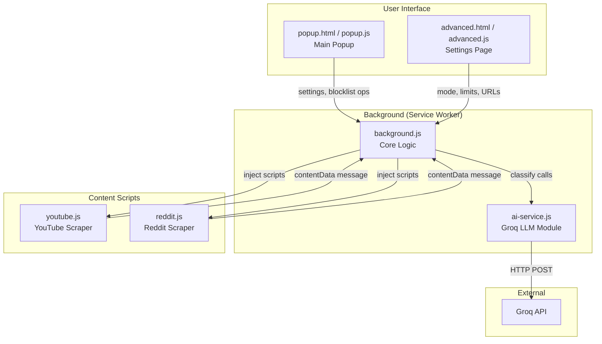
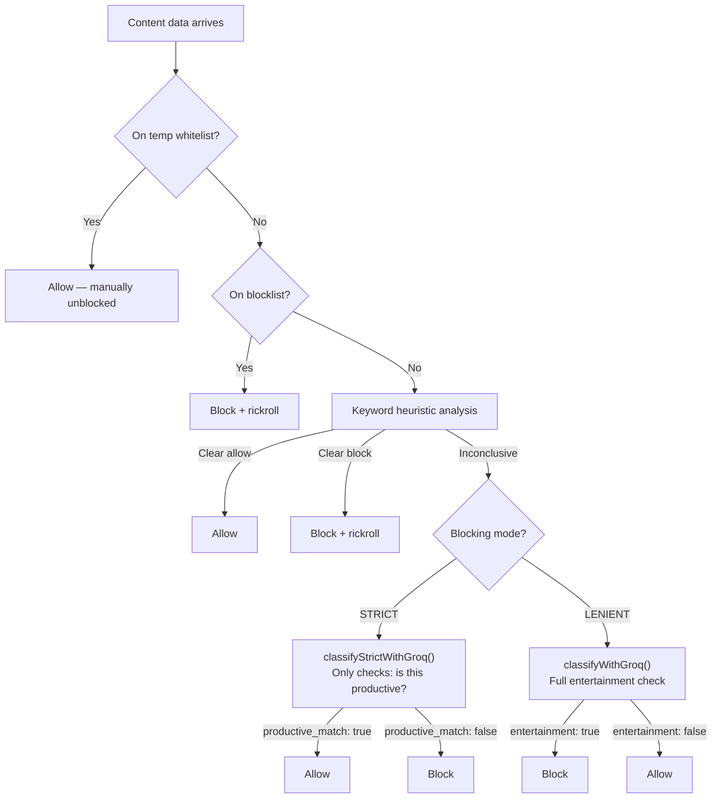

# Productivity Extension — Codebase Analysis

## Overview

A **Chrome Manifest V3** extension that helps users stay productive by blocking distracting content. It uses the **Groq API** (llama-3.1-8b-instant) to classify YouTube and Reddit content as productive or entertainment, and can block entire websites or just their homepages with optional daily time limits.

---

## Architecture Diagram



---

## File-by-File Breakdown

### [manifest.json](file:///d:/Projects/extension/manifest.json)
Chrome MV3 manifest. Declares:
- **Permissions**: `storage`, `tabs`, `scripting`, `webNavigation`
- **Host permissions**: `*.youtube.com`, `*.reddit.com`, `api.groq.com`
- **Background**: service worker ([background.js](file:///d:/Projects/extension/background.js), ES module)
- **Content scripts**: [reddit.js](file:///d:/Projects/extension/reddit.js) injected on `reddit.com/r/*`
- **Popup**: [popup.html](file:///d:/Projects/extension/popup.html)

---

### [background.js](file:///d:/Projects/extension/background.js) — Core Logic (348 lines)

The central orchestrator. Handles:

| Feature | How it works |
|---|---|
| **URL matching** | [urlMatchesStrictRule()](file:///d:/Projects/extension/background.js#22-44) supports full URLs, hostnames, and hostname+path prefixes |
| **Content script injection** | [injectContentScript()](file:///d:/Projects/extension/background.js#47-63) programmatically injects [youtube.js](file:///d:/Projects/extension/youtube.js) or [reddit.js](file:///d:/Projects/extension/reddit.js) |
| **Block actions** | [handleBlockAction()](file:///d:/Projects/extension/background.js#66-78) either redirects to Rick Astley's "Never Gonna Give You Up" or applies a CSS greyscale filter |
| **Time tracking** | A `setInterval(…, 1000)` loop tracks seconds spent on YouTube/Reddit homepages and strict-blocklisted URLs |
| **Daily reset** | Resets `secondsUsedToday` counters when the date changes  |
| **Content classification pipeline** | [handleContentData()](file:///d:/Projects/extension/background.js#240-280) — the main decision flow for YouTube/Reddit content: |

#### Classification Pipeline (in [handleContentData](file:///d:/Projects/extension/background.js#240-280))



**Key design choices:**
- Blocked channels/subreddits are persistently added to a `blocklist` in `chrome.storage.local`
- Temporarily unblocked items go into `tempWhitelist` with a 10-minute expiry
- Classification results are stored in `chrome.storage.session` keyed by tab ID

---

### [ai-service.js](file:///d:/Projects/extension/ai-service.js) — LLM Module (430 lines)

Four exported functions, all calling Groq's `/openai/v1/chat/completions` endpoint:

| Function | Purpose |
|---|---|
| [generateKeywordMaps()](file:///d:/Projects/extension/ai-service.js#5-125) | Takes user's productive/unwanted terms, asks LLM to expand each into 8-15 keywords with synonyms, slang, hashtags. Returns `{ productive: {...}, unwanted: {...} }` |
| [generateUserInstructions()](file:///d:/Projects/extension/ai-service.js#126-196) | Creates generalized classification rules from user prefs (e.g., "relevant_topics", "entertainment_indicators") |
| [classifyWithGroq()](file:///d:/Projects/extension/ai-service.js#197-327) | **Lenient mode** — full entertainment check. Uses a chain-of-thought prompt with productive override rules |
| [classifyStrictWithGroq()](file:///d:/Projects/extension/ai-service.js#328-431) | **Strict mode** — only checks if content matches the productive list |

**Keyword normalization** in [generateKeywordMaps()](file:///d:/Projects/extension/ai-service.js#5-125) includes token-level splitting (e.g., "machine learning" → also adds "machine", "learning" if ≥3 chars) for fuzzier matching.

---

### [youtube.js](file:///d:/Projects/extension/youtube.js) — YouTube Content Script (152 lines)

Injected into YouTube watch pages. Extracts:
- **Video title** (multiple selector fallbacks)
- **Channel name** (multiple selector fallbacks)
- **Video description** (clicks "Show more" button, waits 1s, tries 6 CSS selectors)

Uses a 6-second delay before extraction to let the page load. Has a retry mechanism ([sendMessageWithRetry](file:///d:/Projects/extension/youtube.js#18-34), max 3 retries with 5s delay) for when the background script isn't ready.

Uses `window.runYoutubeAnalysis` as a guard to avoid re-defining functions on re-injection.

---

### [reddit.js](file:///d:/Projects/extension/reddit.js) — Reddit Content Script (52 lines)

Injected into Reddit subreddit pages. Handles two cases:
- **Post pages** (`/comments/`): extracts title, post body paragraphs, top 5 comments
- **Subreddit feeds**: extracts subreddit name, sidebar description, all visible post titles

Much simpler than the YouTube script — no retry mechanism, no description expansion.

---

### [popup.html](file:///d:/Projects/extension/popup.html) + [popup.js](file:///d:/Projects/extension/popup.js) — Main Popup UI

Two-tab popup (Classifier / Settings):
- **Classifier tab**: shows real-time classification status for the active tab, displays the blocklist with search and per-item remove buttons
- **Settings tab**: Groq API key, productive/unwanted content textareas, and a "Save" button that triggers keyword map + instruction regeneration. Links to the advanced settings page.

Listens to `chrome.storage.onChanged` to live-update the blocklist and classification state.

---

### [advanced.html](file:///d:/Projects/extension/advanced.html) + [advanced.js](file:///d:/Projects/extension/advanced.js) — Advanced Settings

Opens in a full tab. Four sections via sidebar navigation:

| Section | Controls |
|---|---|
| **Mode** | STRICT vs LENIENT toggle (segmented control) |
| **Homepage Blocking** | YouTube/Reddit daily minute limits + exact URL blocklist (always blocked) |
| **Website Blocking** | URL-prefix blocklist with per-site daily minute limits |
| **Advanced** | Block action (Rickroll vs Greyscale), heuristic dominance ratio |

Settings auto-save on change. Renders timer UI (SVG circle + remaining time) for sites with limits.

---

## Heuristic Keyword Analysis ([analyzeWithKeywords](file:///d:/Projects/extension/background.js#310-349) in background.js)

The first-pass, local classification (no API call):
1. Flattens all keyword maps into `productiveKw` and `unwantedKw` sets
2. Combines title, description, content, channel/subreddit, and comments into one lowercase text blob
3. Counts regex word-boundary matches for each keyword
4. Decision rules:
   - `< 3 total hits` → inconclusive, falls through to LLM
   - `unwantedHits / productiveHits >= dominanceRatio` (default 2.0) → **block**
   - `productiveHits / unwantedHits >= dominanceRatio` → **allow**
   - Otherwise → inconclusive → LLM

---

## ⚠️ Issues & Broken Code

### 🔴 Critical Issues

#### 1. Timer Feature Doesn't Work Properly
The timer tracking in [background.js](file:///d:/Projects/extension/background.js) (lines 84-172) has fundamental problems:

- **Only tracks homepage time, not all site time**: The `setInterval` loop only increments `secondsUsedToday` when the user is **exactly** on `youtube.com/` or `reddit.com/` (the homepages). Time spent watching individual YouTube videos or browsing Reddit posts is **NOT tracked**.
- **Service Worker lifecycle**: Chrome MV3 service workers are **terminated after ~30 seconds of inactivity**. The `setInterval(…, 1000)` loop will stop running when Chrome kills the service worker. This means time tracking is fundamentally unreliable using this approach.
- **Timer UI is display-only**: The circular timer in [advanced.js](file:///d:/Projects/extension/advanced.js) renders once and never updates in real-time. The page must be refreshed to see updated timer values.
- **No `Save` button for homepage limits**: The YouTube and Reddit minute limits in the Homepage Blocking tab save on `change` events, but there's no explicit save confirmation, and the UI doesn't clearly communicate this.

#### 2. Function Signature Mismatch in [ai-service.js](file:///d:/Projects/extension/ai-service.js)

[classifyWithGroq](file:///d:/Projects/extension/ai-service.js#197-327) and [classifyStrictWithGroq](file:///d:/Projects/extension/ai-service.js#328-431) have **mismatched function signatures**:

```diff
  // In background.js (caller):
  classifyWithGroq(data, groqApiKey, productiveContent, unwantedContent, userInstructions)
  classifyStrictWithGroq(data, groqApiKey, productiveContent)

  // In ai-service.js (definition):
- export async function classifyWithGroq(data) {           // ignores extra args
-     const { groqApiKey, ... } = await chrome.storage.local.get([...]);  // re-reads from storage
+ export async function classifyStrictWithGroq(data) {      // same issue
+     const { groqApiKey, ... } = await chrome.storage.local.get([...]);
```

The functions accept `data` as the only parameter and read everything else from `chrome.storage.local` internally. The arguments passed from [background.js](file:///d:/Projects/extension/background.js) (`groqApiKey`, `productiveContent`, etc.) are **silently ignored**. This works by accident because the storage values exist, but it's wasteful (double reads) and confusing.

#### 3. API Keys Exposed in [.env](file:///d:/Projects/extension/.env)
The [.env](file:///d:/Projects/extension/.env) file contains actual API keys (Groq, YouTube, Reddit, Neon DB) in plaintext. These keys are **not used anywhere in the extension code** — the extension gets its Groq API key from user input via the popup settings. The [.env](file:///d:/Projects/extension/.env) file appears to be leftover/unused and is a security risk if committed to Git. The [.gitignore](file:///d:/Projects/extension/.gitignore) only filters [.env](file:///d:/Projects/extension/.env) — need to verify it hasn't already been committed.

---

### 🟡 Moderate Issues

#### 4. Rickroll Loop Bug (from [todo.txt](file:///d:/Projects/extension/todo.txt))
When content is blocked and the user is redirected to the rickroll URL, closing the tab is the only way to stop. If the user navigates back, the `tabs.onUpdated` listener fires again on the *original* blocked URL, re-triggering the block. But staying on the rickroll URL doesn't re-trigger because of the `tab.url === rickrollUrl` guard on line 177. The bug is that navigating back puts the user in a redirect loop.

#### 5. No Retry Logic for Reddit Content Script
[youtube.js](file:///d:/Projects/extension/youtube.js) has [sendMessageWithRetry()](file:///d:/Projects/extension/youtube.js#18-34) (3 retries, 5s apart), but [reddit.js](file:///d:/Projects/extension/reddit.js) fires a single `chrome.runtime.sendMessage` with no retry. On slow connections or if the service worker is inactive, the message can silently fail.

#### 6. Reddit DOM Selectors May Be Stale
Reddit has changed its UI multiple times. The selectors like `div[data-test-id="post-content"]`, `div[data-testid="comment"]`, and `h3[id^="post-title-"]` may not match Reddit's current DOM, especially on the new Reddit redesign (2024+). This could cause the content script to extract empty data silently.

#### 7. YouTube Content Script Re-injection
[youtube.js](file:///d:/Projects/extension/youtube.js) is injected both via [manifest.json](file:///d:/Projects/extension/manifest.json) content_scripts (not actually — only [reddit.js](file:///d:/Projects/extension/reddit.js) is declared there) AND via [injectContentScript()](file:///d:/Projects/extension/background.js#47-63) in [background.js](file:///d:/Projects/extension/background.js). The `window.runYoutubeAnalysis` guard prevents re-definition of functions but still re-triggers analysis on every navigation. Combined with YouTube's SPA navigation, this can cause duplicate analysis calls.

#### 8. SVG Timer Circle Math Is Incorrect
In [advanced.js](file:///d:/Projects/extension/advanced.js) line 197, the `stroke-dashoffset` calculation uses a circumference of 100, but the actual SVG circle has `r="16"`, giving a circumference of `2 * π * 16 ≈ 100.53`. The `stroke-dasharray` is hardcoded to `100`. This means the timer circle will never fully complete — there'll always be a tiny gap.

---

### 🟢 Minor Issues

#### 9. Debug Logging Left In
[ai-service.js](file:///d:/Projects/extension/ai-service.js) has extensive `console.log` and `console.error` calls including `"TRYING TO FIGURE THIS OUT!!!"` (line 297). These should be cleaned up or put behind a debug flag for production.

#### 10. Commented-Out Code
Lines 307-321 in [ai-service.js](file:///d:/Projects/extension/ai-service.js) contain a large block of commented-out code from an earlier implementation approach. Should be removed.

#### 11. Unused [.env](file:///d:/Projects/extension/.env) Keys
`YOUTUBE_API_KEY`, `REDDIT_API_KEY`, and `NEON_API_KEY` are defined in [.env](file:///d:/Projects/extension/.env) but not referenced anywhere in the extension code. These appear to be from another project or planned features that were never implemented.

#### 12. No Error Feedback to User
When Groq API calls fail (rate limits, network errors, invalid key), the failure is logged to console but never surfaced to the user. The popup just shows "Loading..." indefinitely or "No classification available."

#### 13. Greyscale Blocking Also Disables Interaction
In [handleBlockAction()](file:///d:/Projects/extension/background.js#66-78), the greyscale CSS filter also adds `pointer-events: none`, effectively freezing the page. If applied to a page the user is actively using (e.g., a timed site), there's no way to interact without opening DevTools. This makes the greyscale option significantly harsher than it appears.

---

## Storage Schema

| Key | Type | Purpose |
|---|---|---|
| `groqApiKey` | `string` | User's Groq API key |
| `productiveContent` | `string` | Raw productive topics text |
| `unwantedContent` | `string` | Raw unwanted topics text |
| `keywordMaps` | `{ productive: {...}, unwanted: {...} }` | LLM-expanded keyword maps |
| `userInstructions` | `{ relevant_topics: [...], entertainment_indicators: [...] }` | LLM-generated classification rules |
| `blockingMode` | `"STRICT"` \| `"LENIENT"` | Classifier strictness |
| `blockAction` | `"RICKROLL"` \| `"GREYSCALE"` | What happens on block |
| `blocklist` | `string[]` | Permanently blocked channels/subreddits |
| `tempWhitelist` | `{ [key]: { timestamp } }` | Temporarily unblocked items (10min) |
| `youtubeLimit` | `{ limitMinutes, secondsUsedToday }` | YouTube homepage timer |
| `redditLimit` | `{ limitMinutes, secondsUsedToday }` | Reddit homepage timer |
| `strictUrlBlocklist` | `{ url, limitMinutes, secondsUsedToday }[]` | Website blocklist with timers |
| `exactUrlBlocklist` | `string[]` | Always-blocked exact URLs |
| `heuristicDominanceRatio` | `number` | Keyword ratio threshold (default 2.0) |
| `lastResetDate` | `string` | ISO date for daily timer reset |

Session storage (per tab):

| Key | Type | Purpose |
|---|---|---|
| `[tabId]` | `{ status?, entertainment, reasoning, key, timestamp }` | Classification result for popup display |

---

## What Works Well

- **Layered classification**: The keyword heuristic → LLM fallback approach is smart — it saves API calls for clear-cut cases and uses the LLM for ambiguous ones.
- **Two blocking modes** give users flexibility between "whitelist only" (STRICT) and "blacklist mainly" (LENIENT).
- **Clean UI design**: Both the popup and advanced settings page have polished dark-mode aesthetics with the Quicksand font and pink accent color.
- **Temporary unblock**: The 10-minute whitelist is a nice UX touch for false positives.
- **Keyword expansion**: Using the LLM to expand user terms into related keywords, synonyms, and slang improves matching significantly.
